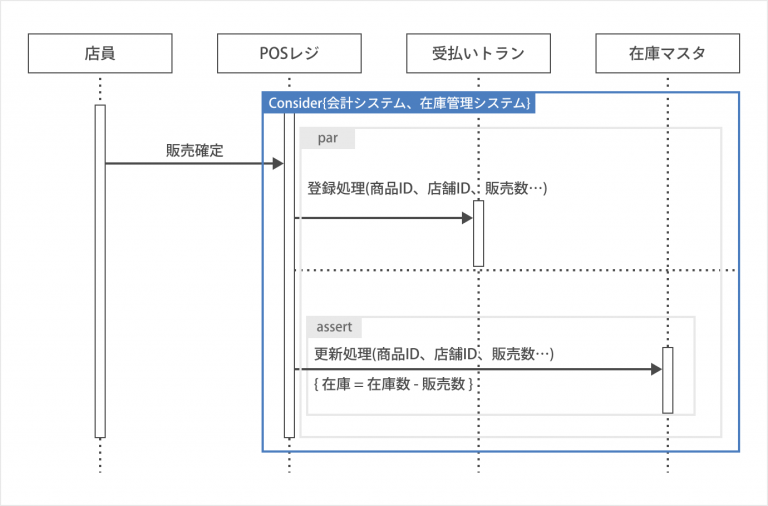

# 目的
この記事は「このサービスのシーケンス図書いといて〜」って言われた時に「え...!?シーラカンス??ギャハハハハハ」とかにならないように「おけです！少々お待ちを〜」くらいで返せるようになってもらうことが目的。
# 背景
去年現在働いている会社でインターンしていた時に先輩がシーケンス図書くように言われていてなんじゃそれ→スルー　という技術者としてあるまじき行為をしたせいで、OJTで痛い目をみたのでこれはいい記事になると思い、書くことにした。

# シーケンス図
## シーケンス図というのは


シーケンス図とはこのように**システムの処理や流れを理解するために使われる図**のことである。
主体を決めてその主体からそのようにシステムが動いているかを記載する必要がある。

## どのような時に使うか
業務フローを考える時に使うケースが多い。
例えば私の会社では現状のシステムの作りがあり、このシステムをどのように変更していくか。その目的の業務フローを作成する時にシーケンス図を使用した。

シーケンス図を書いて業務フローを改めて見直すことはとても重要なことである。
稀にあるケースとして、プログラムを実装し、ユーザに使ってもらう段階でこのフローの場合に明らかに問題が発生するというものがある。
設計段階前にシーケンス図をしっかりと書くことでこのような問題を避けることができるケースが往々にして存在している。

## メリット・デメリット
### メリット
+ 設計前にシステムの全体像を把握することができる
+ 保守・運用時にも機能追加が容易に行える
→開発者と保守運用者が別の場合に現状把握に苦労することがある。
+ エビデンスとして活用できる
→シーケンス図をクライアントとも共有して問題ないことを確認できる
### デメリット
特に書くことによるデメリットは存在しない

# UMLとは
簡単にいうとUMLは図を書くためのツールのことである。
だがすごいことにこの図はコードで書くことができる。つまり図を写真として共有するだけでなくgitで共有したりなんてことも可能なのである。

# いや、どーやって描く(書く)ねーん
多くの人がUMLを使うときは**PlantUML**というvisual studio code(vscode)の拡張機能を利用している。
## 環境を作る
### PlantUMLをインストールする
1. vscodeをインストール
2. 拡張機能(現在では左サイドバーの一番下)でPlantUMLをインストール

### javaをインストールする
```
brew install --cask adoptopenjdk
```

### Graphvizをインストールする
```
brew install graphvi
```
### .pu拡張子のファイルを作成する
UMLはpuファイルで作成するため空のpuファイルを作成

### 描いたUMLをpreviewする
```
cmd + shift + d
```
### 画像ファイルを出力する
正直個人開発や趣味程度ならプレビューをスクショの方が早いかも知れないが実務ではちゃんと出力する必要がある
```
cmd + shift + p → コマンド検索 → PlantUML: Export Current Diagram
```

## 書き方
+ ->
・・・  リクエスト
+ -->
・・・ レスポンス
+ ->>
・・・ 非同期のリクエスト
+ activate, deactivate
・・・ 縦線の人が動いている期間
+ : phrase
・・・ 矢印に付随す文字
+ alt + end
・・・ 条件分岐
+ title
・・・ 図のタイトル
+ actor + ラインの名前で宣言
・・・ 人マーク
+ boundary + ラインの名前で宣言
・・・ システムマーク


# 結論
私自身最近初めて研修でUMLを触ったため全然知識はありませんが、ある限りのことは共有した。
わかることであれば答えたいと思っているのでいつでも連絡してください。

